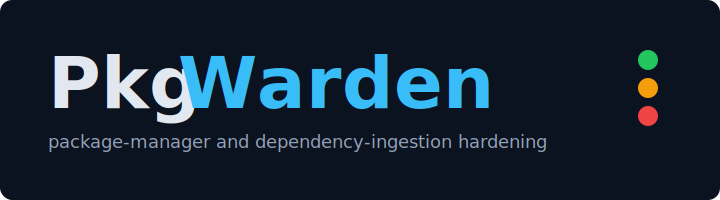

<p align="center">
  
</p>

<p align="center"><strong>Package-manager and dependency-ingestion hardening.</strong></p>

<p align="center">
  <a href="https://github.com/Ozark-Security-Labs/PkgWarden/actions/workflows/ci.yml"></a>
  <a href="https://github.com/Ozark-Security-Labs/PkgWarden/actions/workflows/repo-hygiene.yml"></a>
  <a href="https://github.com/Ozark-Security-Labs/PkgWarden/actions/workflows/scorecard.yml"></a>
  <a href="LICENSE"></a>
  
</p>

---

PkgWarden maps package-manager and dependency-ingestion hardening posture across a repository. It answers a foundational supply-chain question — **how is this codebase actually acquiring its dependencies, and where are the controls weak?** — by inspecting manifests, lockfiles, package-manager config, dependency-bot config, and CI workflows, then reporting evidence-bound hardening gaps with file/line spans.

Supply-chain compromise is often a configuration failure before it is a dependency failure. PkgWarden gives you the inventory.

## Quickstart

Install from source:

```bash
go install github.com/Ozark-Security-Labs/PkgWarden/cmd/pkgwarden@latest
```

Prebuilt binaries for Linux, macOS, and Windows will be attached to each [GitHub Release](https://github.com/Ozark-Security-Labs/PkgWarden/releases) starting with v0.1.

Then scan a repository:

```bash
pkgwarden scan . --profile baseline --format markdown --output pkgwarden.md
```

Use it in CI with the GitHub Action (ships with v0.1):

```yaml
- uses: actions/checkout@v5
- uses: Ozark-Security-Labs/PkgWarden@v0.1.0
  with:
    profile: baseline
    output: markdown,json
```

## Sample output

A scan of a Node + Python repository classifies each manager and surfaces hardening gaps:

```text
File: .npmrc:1
Manager: npm
Rule: PW-NPM-001 missing minimum-release-age (cooldown)
Severity: high
Evidence:
  - registry=https://registry.npmjs.org/
  - minimum-release-age not configured
Recommendation:
  - Set minimum-release-age=10080 (7 days) in .npmrc
  - Or set minimum-release-age=20160 (14 days) under strict profile
```

The same scan emits JSON for automation (schema v1 contract):

```json
{
  "rule_id": "pnpm.cooldown.minimum_release_age",
  "title": "pnpm minimumReleaseAge is not configured",
  "severity": "medium",
  "confidence": "high",
  "category": "cooldown",
  "ecosystem": "node",
  "package_manager": "pnpm",
  "message": "Configure a release-age gate before accepting newly published packages."
}
```

A SARIF report covering the same findings is available for advisory GitHub code scanning.

## Supported ecosystems

| Package manager        | Coverage area                                  |
| ---------------------- | ---------------------------------------------- |
| npm, pnpm, Yarn, Bun   | Node.js / TypeScript manifests, lockfiles, config |
| pip, uv, Poetry        | Python manifests, lockfiles, config            |
| Dependabot, Renovate   | Dependency-bot cooldown alignment              |
| GitHub Actions         | CI install-command analysis                    |

Plus rule coverage for `.npmrc`, `pip.conf`, `.yarnrc.yml`, `bunfig.toml`, and equivalent package-manager config files. Java, .NET, Ruby, Rust, and Go ecosystems are scheduled for v0.3.

## What you get

**Composable profiles.** `baseline`, `strict`, `socket-firewall`, `veracode-package-firewall`, `private-registry`, `regulated-ci`, and `oss-maintainer`. Each profile selects which rules apply and how strict each rule is. Defaults: 7-day cooldown (baseline), 14-day cooldown (strict).

**Evidence-bound findings.** Every finding includes the rule ID, the file path and line, the observed value, the expected value under the active profile, and a concrete recommendation expressed as the exact line to change. Optional autofix metadata ships with M5.

**Repository policy.** A `.pkgwarden.yml` file pins the active profile, declares approved registries, overrides rule severity, and records suppressions. See [docs/CONFIGURATION.md](docs/CONFIGURATION.md).

**Token redaction.** Token-shaped values are redacted in every output format. Reports remain safe to attach to PRs and CI artifacts; see [docs/DATA_HANDLING.md](docs/DATA_HANDLING.md) for sensitivity and sharing guidance.

**Advisory by default.** Findings are evidence-bound recommendations unless mechanically proven. Enforce mode is opt-in per CI step.

## Output formats

| Format   | Use it for                                                |
| -------- | --------------------------------------------------------- |
| Markdown | Human review, PR comments, GitHub Actions job summaries   |
| JSON     | Automation and downstream tooling (schema v1 contract)    |
| SARIF    | GitHub / GitLab code scanning, advisory alerts            |
| Human    | Interactive CLI use                                       |

The canonical JSON contract is documented in [docs/SCHEMA.md](docs/SCHEMA.md).

## CI integration

Run PkgWarden on every pull request and gate enforcement on a severity threshold:

```yaml
name: PkgWarden
on:
  pull_request:

permissions:
  contents: read

jobs:
  pkgwarden:
    runs-on: ubuntu-latest
    steps:
      - uses: actions/checkout@v5
      - uses: Ozark-Security-Labs/PkgWarden@v0.1.0
        with:
          profile: strict
          mode: enforce
          fail-on: high
          output: markdown,json
```

Enforce mode writes the requested reports first, then exits `20` when findings meet the `fail-on` threshold or scan diagnostics escalate to error severity. SARIF upload is optional and requires `security-events: write`. See [docs/GITHUB_ACTION.md](docs/GITHUB_ACTION.md) for all inputs, outputs, and permission details.

### Exit codes

| Code | Meaning                                                                              |
| ---- | ------------------------------------------------------------------------------------ |
| 0    | Success                                                                              |
| 2    | CLI usage error, including unsupported `--profile` or `--format` values              |
| 10   | Target path does not exist or is not readable                                        |
| 11   | Enforce-mode target exists but contains no supported manifests                       |
| 12   | Policy file cannot be read, parsed, or validated                                     |
| 13   | Scan pipeline failed for another reason                                              |
| 14   | Report rendering or writing failed                                                   |
| 20   | Enforce-mode failure: findings met `--fail-on` threshold after the report was written |

## Project status

- **Pre-v0.1.** The scanner core (milestone M0, issues PW-001 through PW-010) is in active development. The CLI in `cmd/pkgwarden/` is currently a scaffold; rules and reporters land progressively across M0–M4.
- **v0.1** will ship the first stable CLI, prebuilt binaries for Linux/macOS/Windows, the `Ozark-Security-Labs/PkgWarden` GitHub Action, the public rule catalog, and the SARIF reporter. See [docs/RELEASES.md](docs/RELEASES.md) and [docs/ROADMAP.md](docs/ROADMAP.md).
- **JSON schema** — v1 contract; breaking changes ship via the documented compatibility policy.
- **Go** — module targets Go 1.23, single module.
- **Platforms** — Linux, macOS, and Windows are tested in CI on every push.

## Documentation

| Document                                                                       | Contents                                                              |
| ------------------------------------------------------------------------------ | --------------------------------------------------------------------- |
| [docs/USAGE.md](docs/USAGE.md)                                                 | End-to-end CLI usage, output interpretation, defensive-use guidance   |
| [docs/SCHEMA.md](docs/SCHEMA.md)                                               | JSON schema and contract                                              |
| [docs/CONFIGURATION.md](docs/CONFIGURATION.md)                                 | `.pkgwarden.yml`, profiles, approved registries, rule overrides       |
| [docs/DIAGNOSTICS.md](docs/DIAGNOSTICS.md)                                     | Diagnostic categories, stable codes, exit behavior                    |
| [docs/GITHUB_ACTION.md](docs/GITHUB_ACTION.md)                                 | All Action inputs, outputs, and permissions                           |
| [docs/ARCHITECTURE.md](docs/ARCHITECTURE.md)                                   | Layered scanner design overview                                       |
| [docs/IMPLEMENTATION_ARCHITECTURE.md](docs/IMPLEMENTATION_ARCHITECTURE.md)     | Go package layout and implementation patterns                         |
| [docs/PARSERS_AND_ADAPTERS.md](docs/PARSERS_AND_ADAPTERS.md)                   | Parser conventions and line-aware spans                               |
| [docs/PRODUCT_BRIEF.md](docs/PRODUCT_BRIEF.md)                                 | Product framing and threat model                                      |
| [docs/NON_GOALS.md](docs/NON_GOALS.md)                                         | Explicit out-of-scope items                                           |
| [docs/ROADMAP.md](docs/ROADMAP.md)                                             | Milestones and delivery plan                                          |
| [docs/RELEASES.md](docs/RELEASES.md)                                           | Versioning, changelog, and compatibility policy                       |
| [docs/SUPPLY_CHAIN.md](docs/SUPPLY_CHAIN.md)                                   | Dependency, lockfile, and CI security policy                          |
| [docs/DATA_HANDLING.md](docs/DATA_HANDLING.md)                                 | Report sensitivity, redaction, and sharing guidance                   |

## Security

PkgWarden is intended for authorized, defensive analysis of repositories that you own or are explicitly approved to review. Report vulnerabilities privately via GitHub Security Advisories — see [SECURITY.md](SECURITY.md).

Supply-chain posture:

- All GitHub Actions in workflows are pinned to a full commit SHA.
- CI runs `Ozark-Security-Labs/deterministic-deps` (advisory) and OpenSSF Scorecard on every PR and push to `main`.
- Cross-platform CI matrix runs `go build`, `go test`, `go vet`, and `gofmt` on Linux, macOS, and Windows.

Details in [docs/SUPPLY_CHAIN.md](docs/SUPPLY_CHAIN.md).

## Contributing

Design-first contributions are welcome — new rules and fixtures, ecosystem coverage, documentation, and reviewable detections.

- [CONTRIBUTING.md](CONTRIBUTING.md) — how to propose and submit changes
- [CODE_OF_CONDUCT.md](CODE_OF_CONDUCT.md) — community standards
- [CHANGELOG.md](CHANGELOG.md) — what changed and when
- [SUPPORT.md](SUPPORT.md) — getting help

Reference the relevant `PW-###` issue id in commit messages and pull request descriptions.

## Non-goals

PkgWarden does not maintain a CVE database, score package reputation, detect malware, replace SCA or package-firewall products, scan license compliance, generate an SBOM as a primary feature, or perform exploitability analysis. A clean PkgWarden report does not imply a clean dependency tree — it implies a hardened acquisition posture.

## License

PkgWarden is licensed under the [GNU Affero General Public License v3.0 only](LICENSE) (`AGPL-3.0-only`).
